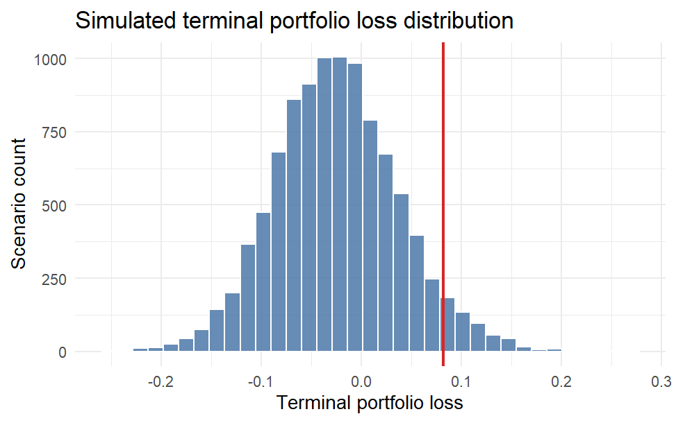

```{r, include = FALSE}
knitr::opts_chunk$set(
  collapse = TRUE,
  comment = "#>"
)

options(rmarkdown.html_vignette.check_title = FALSE)
```

```{r setup}
library(scenario2risk)
```

Welcome! Here is everything behind `scenario2risk`.

Rather than treating risk as a purely historical summary, the package was built
around the idea that downside portfolio risk can be studied through
macro-financial scenarios.

## Why this package?

Many applications stop at one of two extremes:

- simple historical summaries with little economic structure
- complex risk engines that are hard to explain and harder to package

`scenario2risk` sits in the middle. It uses a factor-augmented VAR framework to
connect macro conditions with asset returns, but exposes that model through a
small set of user-facing functions.

## Design motivation

The package was created around three practical design ideas:

1. Macro conditions matter for portfolio risk, so the model should accept a
   flexible set of macro predictors instead of only historical asset returns.
2. Users usually care about portfolio loss summaries such as VaR and expected
   shortfall, not only raw simulated return paths.
3. A compact package should still provide model checking, so the scenario-based
   VaR output can be compared against realized rolling losses.

This leads to two core workflows:

- `portfolio_risk()` for scenario-based terminal-loss measurement
- `model_check()` for rolling VaR exceedance comparisons

## Package assumptions and built-in choices

Some parts of the package are intentionally flexible, while others are fixed by
design.

### Flexible part: macro predictors

The `macro_data` input can contain any set of numeric monthly predictor series,
as long as:

- there is a `date` column
- the remaining predictor columns are numeric
- there are enough overlapping monthly observations after alignment

This means users can include yield spreads, inflation measures, labor-market
variables, production indicators, sentiment variables, or other
macro-financial series they believe are informative.

### Fixed part: asset universe

The portfolio side of the package is fixed to three asset categories:

- `equity`
- `bond`
- `cash`

That fixed structure keeps the package simple and makes portfolio aggregation
and model checking easier to explain. In practice, this means the return input
must always contain:

- `equity_return`
- `bond_return`
- `cash_return`

and the portfolio weights input must contain one row for each of those three
assets.

## What should the input data look like?

The package works with three input tables:

- `macro_data`
- `return_data`
- `portfolio`

### `macro_data`

`macro_data` should be a data frame with:

- one `date` column
- one or more numeric macro predictor columns
- monthly observations

Below is the structure of the built-in example data:

```{r}
head(demo_macro_data)
```


### `return_data`

`return_data` should be a data frame with:

- one `date` column
- `equity_return`
- `bond_return`
- `cash_return`

These returns should be aligned at the same monthly frequency as the macro
predictors.

```{r}
head(demo_return_data)
```

### `portfolio`

`portfolio` should be a data frame with:

- one `asset` column
- one `weight` column

The package expects exactly the three supported asset names and a fully
invested long-only portfolio.

```{r}
demo_portfolio_weights
```


## Overall workflow


1. Align macro predictors and asset returns by date.
2. Extract a small number of macro factors using principal components.
3. Fit a VAR model to the macro factors and asset returns.
4. Simulate future scenario paths.
5. Aggregate simulated asset returns into portfolio-level losses.
6. Summarize downside risk or compare VaR exceedances.

The next two sections walk through the package's main workflows.

## Workflow 1: Estimate portfolio downside risk

We start by estimating scenario-based terminal-loss risk over a 12-month
horizon.

```{r}
risk <- portfolio_risk(
  macro_data = macro_data,
  return_data = return_data,
  portfolio = portfolio,
  horizon = 12,
  n_scenarios = 200,
  k = 2,
  var_lag = 1,
  seed = 123
)

risk
```

The returned object contains two main pieces:

- `risk_summary`: a one-row table of risk metrics
- `loss_distribution`: one simulated terminal loss per scenario

Printing the returned object only gives us a risk summary.

The `portfolio_risk()` summary contains:

- `mean_loss`: average simulated terminal loss
- `median_loss`: median simulated terminal loss
- `probability_of_loss`: share of scenarios with a positive loss
- `var_95`: 95% Value-at-Risk for terminal loss
- `es_95`: 95% Expected Shortfall

Together, these measures summarize both the center and the downside tail of the
simulated loss distribution.

We can also visualize the simulated loss distribution:

```{r fig.show='hide'}
plot_portfolio_risk(risk)
```

<p align="center">
  
</p>

In that plot, the histogram shows the simulated distribution of terminal
portfolio loss, and the vertical red line marks the estimated 95% VaR.


## Workflow 2: Check rolling VaR exceedance

Scenario-based risk estimates are more useful when they are checked against
realized outcomes. The `model_check()` function performs a rolling historical
evaluation:

- at each forecast origin, the model is refit on the previous `window` months
- future portfolio losses are simulated over the chosen `horizon`
- the resulting scenario-based VaR is compared with the realized forward loss
- the same comparison is repeated for a historical simulation benchmark

```{r}
check <- model_check(
  macro_data = macro_data,
  return_data = return_data,
  portfolio = portfolio,
  horizon = 6,
  n_scenarios = 50,
  k = 2,
  var_lag = 1,
  seed = 123,
  window = 120,
  n_origins = 6
)

check
```

The output reports the realized exceedance frequency for:

- the FAVAR scenario model
- the historical simulation benchmark

We can visualize that comparison:

```{r fig.show='hide'}
plot_model_check(check)
```

<p align="center">
  
</p>

The dashed red line marks the expected 5% exceedance rate for a 95% VaR model.

## Notes on parameter choices

Several arguments control the behavior of the workflows:

- `horizon`: forecast horizon in months
- `n_scenarios`: number of simulated scenario paths
- `k`: number of macro factors retained
- `var_lag`: lag length of the VAR
- `window`: rolling estimation window used in `model_check()`
- `n_origins`: number of rolling forecast origins used in `model_check()`


## Limitations

The package intentionally keeps the problem simple. In particular:

- the asset universe is fixed to equity, bond, and cash
- the package is built around monthly data
- portfolio weights are long-only and fully invested
- the package is meant for clear scenario-based analysis, not full-scale risk
  infrastructure

These design choices make the package easier to explain, test, and use.

